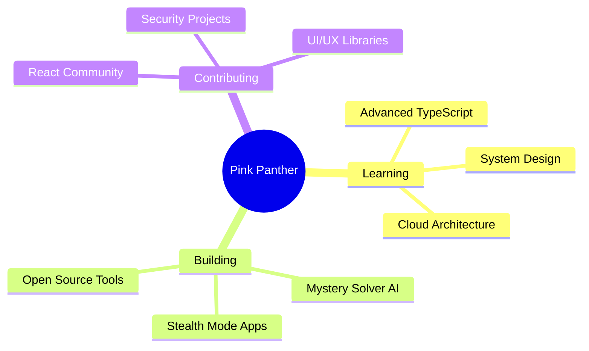

# 🐆 The Pink Panther

<div align="center">
  
  

  

</div>

---

## 🎭 About Me

```python
class PinkPanther:
    def __init__(self):
        self.name = "The Pink Panther"
        self.role = "Full Stack Detective"
        self.location = "Mystery Manor 🏰"
        self.motto = "Code in style, debug in elegance"
        
    def current_mission(self):
        return {
            "🔍": "Solving coding mysteries",
            "💎": "Building elegant solutions",
            "🎨": "Crafting beautiful UIs",
            "🚀": "Deploying stealth mode apps"
        }
    
    def skills(self):
        return ["JavaScript", "Python", "React", "Node.js", "CSS Magic"]
```

<div align="center">
  
  ### 🐾 Sneaking through code since 1963 🐾
  
</div>

---

## 💻 Tech Stack & Tools

<div align="center">

### Languages


### Frameworks & Libraries


### Tools & Platforms


</div>

---

## 📊 GitHub Statistics

<div align="center">
  
  
  
  

</div>

<div align="center">
  
  
  
  

</div>

---

## 🏆 GitHub Trophies

<div align="center">
  
  

</div>

---

## 🚀 Featured Projects

<div align="center">

<a href="https://github.com/YourUsername/mystery-solver">
  
</a>

<a href="https://github.com/YourUsername/stealth-mode">
  
</a>

<a href="https://github.com/YourUsername/pink-diamond-tracker">
  
</a>

<a href="https://github.com/YourUsername/elegant-ui-kit">
  
</a>

</div>

---

## 🎯 Current Focus



---

## 📈 Contribution Activity

<div align="center">
  
  

</div>

---

## 💡 Random Dev Quote

<div align="center">


</div>

---

## 🎨 Coding Stats

<div align="center">

<!--START_SECTION:waka-->
<!--END_SECTION:waka-->


</div>

---

## 🤝 Let's Connect

<div align="center">

[](https://github.com/YourUsername)
[](https://linkedin.com/in/yourprofile)
[](https://twitter.com/yourhandle)
[](mailto:your.email@example.com)
[](https://yourportfolio.com)

</div>

---

<div align="center">
  
  ### 🐾 "In the world of code, I move with grace and precision" 🐾
  
  

</div>

---

<div align="center">
  
  **💖 Thanks for visiting! Leave a ⭐ if you like my work! 💖**
  
  

</div>
